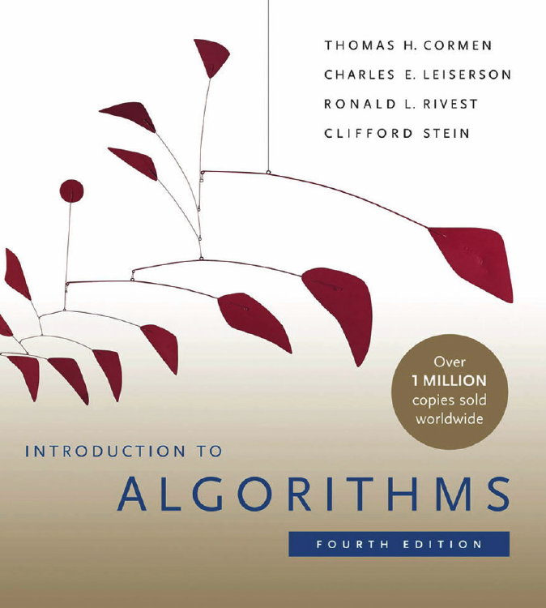

# Introduction to Algorithms (4th Edition)

This is a public repository designed to learn and implement many different algorithms in Computer Science.
The algorithms in this repo will be based on the book [Introduction to Algorithms (4th Edition)](https://mitpress.mit.edu/9780262046305/introduction-to-algorithms/) by Thomas H. Cormen, Charles E. Leiserson, Ronald L. Rivest, and Clifford Stein.

More info to be added.
